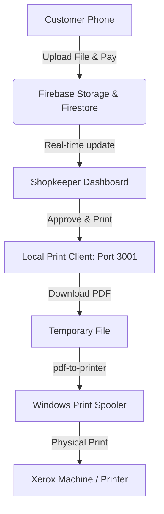

# 🖨️ DigiCenter (Xerox DigiCenter)

DigiCenter is a modern web-based digital service system made for Xerox & printing shops. It replaces manual queues, slow internet, and messaging apps (like WhatsApp) with a fully digital, end-to-end workflow.

---

## 🚀 Features

### 📱 Customer Side
- **QR-code based access**: Scan and upload instantly.
- **Upload documents**: PDF and images supported.
- **Granular Print Customization**:
  - Color / B&W printing.
  - Paper Size (A4 / A3).
  - Sides (Single / Double-sided).
  - **Paper Quality** (Standard 75gsm / Premium 100gsm / Glossy Photo).
  - **Binding Options** (None / Spiral / Hardbound).
- **Dynamic Price Engine**: Real-time calculations as customers change parameters.
- **Direct UPI QR Integration**: Pay via UPI QR code directly on checkout.
- **Order Tracking**: Track the status of jobs (Pending, Processing, Completed).
- **Government Services Intake**: Token generation for Aadhaar / PAN updates, certificates, and more.

### 🏢 Shopkeeper Dashboard (Secured 🔒)
- **Role-based Authentication**: Secured dashboard protected by Firebase Auth (fallback to PIN/Password in offline mode).
- **Real-Time Live Queue**: View new orders and service requests as they are created.
- **Human Request Acceptance**: Accept, Reject, or Print jobs directly from the dashboard.
- **Local Print Integration**: Click "Approve & Print" to send files to the local Windows print spooler.
- **Rates Configuration**: Update print pricing tiers and the shop's UPI ID dynamically.

### 🖨️ Windows Print Client (Local Worker)
- Standing worker running locally on the shop's Windows PC.
- Detects locally installed Windows printers.
- Maps print configurations (e.g., "Black & White (A4)" or "Color (A3)") to specific physical printers.
- Automatically handles file downloading and silent spooling upon dashboard approval.

---

## 🧱 Tech Stack

- **Web Frontend**: React.js / Vite / Vanilla CSS (Tailwind avoided)
- **Cloud Backend**: Firebase
  - **Firestore**: Real-time database.
  - **Storage**: Secure document upload repository.
  - **Authentication**: Secured login flow.
- **Local Worker**: Node.js / Express / `pdf-to-printer`

---

## ⚙️ Setup & Installation

### 1. Web Application Setup
1. Clone this repository.
2. Install dependencies:
   ```bash
   npm install
   ```
3. Copy `.env.example` to `.env` and fill in your Firebase Web App credentials. If left empty, the application runs automatically in **Offline Mock Mode** (using `localStorage` and a local security bypass PIN: `admin123`).
4. Run the development server:
   ```bash
   npm run dev
   ```

### 2. Windows Print Client Setup
1. Open the `print-client` directory.
2. Install dependencies:
   ```bash
   cd print-client
   npm install
   ```
3. Run the print client:
   ```bash
   node server.js
   ```
4. Access the Printer Mapping dashboard at: `http://localhost:3001`
5. Select the physical printers connected to your Windows computer and map them to their corresponding print configurations. Save mappings.

---

## 🔥 System Architecture



---

## ⚠️ Disclaimer

Educational prototype representing local Xerox digitizing workflows. Production use requires compliance, payment gateway verification, and environment security hardening.
