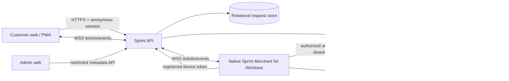
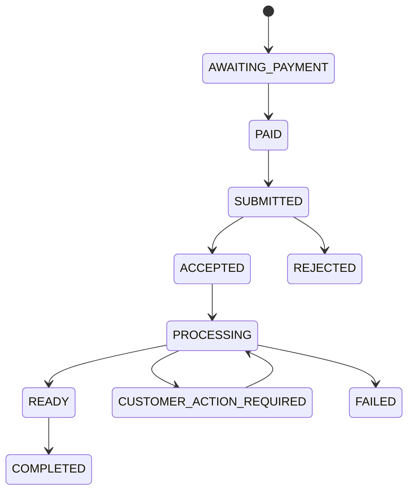

# Sprint architecture

## Canonical request lifecycle

`Request` is the shared product abstraction. It has a type (`PRINT`, `COPY`, `SCAN`, or `SERVICE`) and a backend-enforced state. Print-specific settings live in `print_request_details`; merchant service fields live in `service_request_details`. A state transition always writes an immutable `request_events` row and an audit event.

The API owns price calculation and valid transitions. The browser never submits a final amount. Every mutating customer and device route requires an idempotency key. A physical print has a separate, durable `print_executions` row; it cannot be re-submitted after a final or uncertain state.

## Realtime

Clients request a short-lived authenticated WebSocket ticket over HTTPS, then use it once to open a WSS/WS connection. Events are hints: both customer and merchant clients reconcile through the authoritative HTTP endpoints after reconnect. The ticket avoids placing the long-lived session or device token in a WebSocket URL.

## Files and privacy

Uploads are size- and MIME-checked, signature-checked, sanitized, named by opaque object keys, and stored outside public web roots. The database holds metadata and expiry, not file bytes. The merchant uses an authenticated download route; there are no public storage URLs. The cleanup task deletes expired objects and records deletion state. Merchant temporary files use `%LOCALAPPDATA%\Sprint\Merchant\temporary`, never Documents or Downloads, and are removed after printer submission.

## Payments

`payments` records provider, provider reference, verified status, currency, and amount. The local `DEVELOPMENT_ONLY` provider exists only when development payments are explicitly enabled; it is intentionally isolated from a production provider integration. Production providers must verify server-to-server webhooks before a request becomes paid.

## Security model

- Customer session tokens are generated cryptographically and stored server-side only as hashes.
- Device tokens are hashed and scoped to one authorized shop; revoked devices fail authentication.
- A customer can retrieve only requests tied to their anonymous session; a merchant can retrieve only requests and attachments for the device’s shop.
- API errors are correlation-ID tagged; logs omit file names, tokens, and document contents.
- Service definitions are rejected if their configured fields ask for passwords, OTPs, PINs, biometrics, or DigiLocker credentials.

## Local development schema

The SQL migration is at [`database/migrations/001_initial.sql`](../database/migrations/001_initial.sql). Local development uses SQLite in WAL mode. The schema uses foreign keys, indexes, unique request numbers, idempotency records, and transactional write boundaries. Production should use the same logical schema on a managed relational service with backups and point-in-time recovery.
